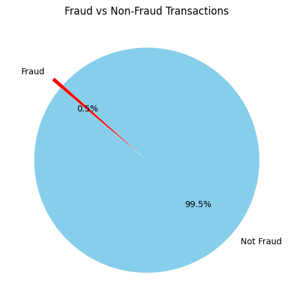
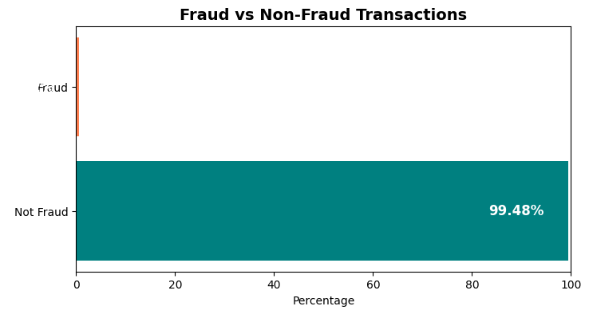
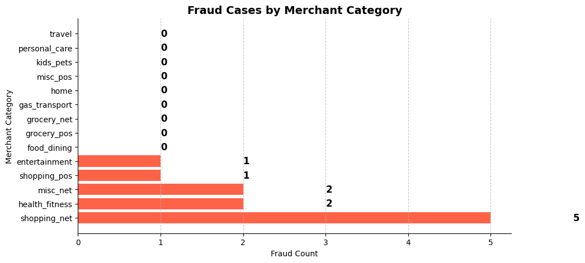
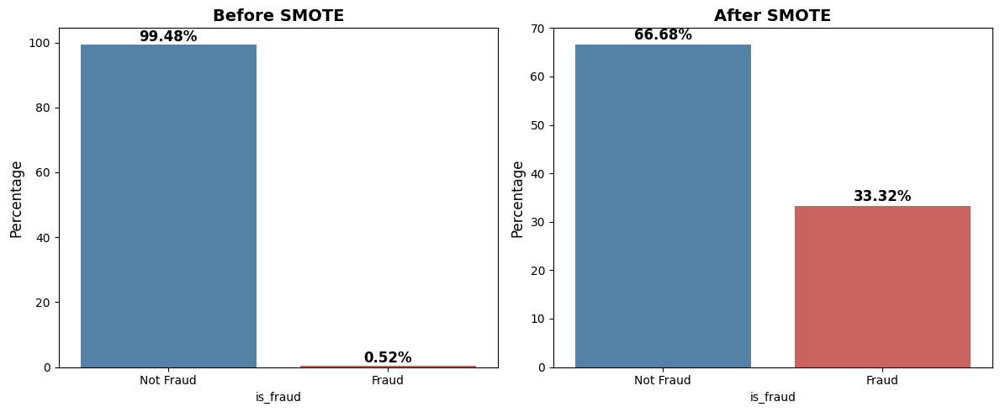

# **Detecting Fraudulent Credit Card Transactions Through Advanced Machine Learning Algorithms.**


```python

```

# Module 1: Data Collection & Exploration

## Step 1: Load and Inspect the Data
#### This step ensures we correctly load the dataset and verify its structure.


```python
import pandas as pd

# Define data types (set `unix_time` as float to avoid NA errors)
dtype_dict = {
    "cc_num": str,  
    "merchant": str,
    "category": str,
    "amt": float,
    "first": str,
    "last": str,
    "gender": str,
    "street": str,
    "city": str,
    "state": str,
    "zip": str,
    "lat": float,
    "long": float,
    "city_pop": float,
    "job": str,
    "dob": str,
    "trans_num": str,
    "unix_time": float,  # Changed to float to handle missing values
    "merch_lat": float,
    "merch_long": float,
    "is_fraud": float
}

# Load dataset with proper date parsing and data types
df = pd.read_csv("fraudTest.csv", dtype=dtype_dict, parse_dates=["trans_date_trans_time"], dayfirst=True, low_memory=False)

# Handle missing values
df["unix_time"] = df["unix_time"].fillna(0).astype(int)  # Fix chained assignment issue

# Display first few rows to verify
df.head()

```


<div>
<style scoped>
    .dataframe tbody tr th:only-of-type {
        vertical-align: middle;
    }

    .dataframe tbody tr th {
        vertical-align: top;
    }

    .dataframe thead th {
        text-align: right;
    }
</style>
<table border="1" class="dataframe">
  <thead>
    <tr style="text-align: right;">
      <th></th>
      <th>Unnamed: 0</th>
      <th>trans_date_trans_time</th>
      <th>cc_num</th>
      <th>merchant</th>
      <th>category</th>
      <th>amt</th>
      <th>first</th>
      <th>last</th>
      <th>gender</th>
      <th>street</th>
      <th>...</th>
      <th>lat</th>
      <th>long</th>
      <th>city_pop</th>
      <th>job</th>
      <th>dob</th>
      <th>trans_num</th>
      <th>unix_time</th>
      <th>merch_lat</th>
      <th>merch_long</th>
      <th>is_fraud</th>
    </tr>
  </thead>
  <tbody>
    <tr>
      <th>0</th>
      <td>0.0</td>
      <td>2020-06-21 12:14:00</td>
      <td>2.29116E+15</td>
      <td>fraud_Kirlin and Sons</td>
      <td>personal_care</td>
      <td>2.86</td>
      <td>Jeff</td>
      <td>Elliott</td>
      <td>M</td>
      <td>351 Darlene Green</td>
      <td>...</td>
      <td>33.9659</td>
      <td>-80.9355</td>
      <td>333497.0</td>
      <td>Mechanical engineer</td>
      <td>19-03-1968</td>
      <td>2da90c7d74bd46a0caf3777415b3ebd3</td>
      <td>1371816865</td>
      <td>33.986391</td>
      <td>-81.200714</td>
      <td>0.0</td>
    </tr>
    <tr>
      <th>1</th>
      <td>1.0</td>
      <td>2020-06-21 12:14:00</td>
      <td>3.57303E+15</td>
      <td>fraud_Sporer-Keebler</td>
      <td>personal_care</td>
      <td>29.84</td>
      <td>Joanne</td>
      <td>Williams</td>
      <td>F</td>
      <td>3638 Marsh Union</td>
      <td>...</td>
      <td>40.3207</td>
      <td>-110.4360</td>
      <td>302.0</td>
      <td>Sales professional, IT</td>
      <td>17-01-1990</td>
      <td>324cc204407e99f51b0d6ca0055005e7</td>
      <td>1371816873</td>
      <td>39.450498</td>
      <td>-109.960431</td>
      <td>0.0</td>
    </tr>
    <tr>
      <th>2</th>
      <td>2.0</td>
      <td>2020-06-21 12:14:00</td>
      <td>3.59822E+15</td>
      <td>fraud_Swaniawski, Nitzsche and Welch</td>
      <td>health_fitness</td>
      <td>41.28</td>
      <td>Ashley</td>
      <td>Lopez</td>
      <td>F</td>
      <td>9333 Valentine Point</td>
      <td>...</td>
      <td>40.6729</td>
      <td>-73.5365</td>
      <td>34496.0</td>
      <td>Librarian, public</td>
      <td>21-10-1970</td>
      <td>c81755dbbbea9d5c77f094348a7579be</td>
      <td>1371816893</td>
      <td>40.495810</td>
      <td>-74.196111</td>
      <td>0.0</td>
    </tr>
    <tr>
      <th>3</th>
      <td>3.0</td>
      <td>2020-06-21 12:15:00</td>
      <td>3.59192E+15</td>
      <td>fraud_Haley Group</td>
      <td>misc_pos</td>
      <td>60.05</td>
      <td>Brian</td>
      <td>Williams</td>
      <td>M</td>
      <td>32941 Krystal Mill Apt. 552</td>
      <td>...</td>
      <td>28.5697</td>
      <td>-80.8191</td>
      <td>54767.0</td>
      <td>Set designer</td>
      <td>25-07-1987</td>
      <td>2159175b9efe66dc301f149d3d5abf8c</td>
      <td>1371816915</td>
      <td>28.812398</td>
      <td>-80.883061</td>
      <td>0.0</td>
    </tr>
    <tr>
      <th>4</th>
      <td>4.0</td>
      <td>2020-06-21 12:15:00</td>
      <td>3.52683E+15</td>
      <td>fraud_Johnston-Casper</td>
      <td>travel</td>
      <td>3.19</td>
      <td>Nathan</td>
      <td>Massey</td>
      <td>M</td>
      <td>5783 Evan Roads Apt. 465</td>
      <td>...</td>
      <td>44.2529</td>
      <td>-85.0170</td>
      <td>1126.0</td>
      <td>Furniture designer</td>
      <td>06-07-1955</td>
      <td>57ff021bd3f328f8738bb535c302a31b</td>
      <td>1371816917</td>
      <td>44.959148</td>
      <td>-85.884734</td>
      <td>0.0</td>
    </tr>
  </tbody>
</table>
<p>5 rows × 23 columns</p>
</div>


```python

```

## Step 2: Check for Duplicates


#### Duplicate transactions can affect model accuracy.


```python
# Count duplicate rows
duplicates = df.duplicated().sum()
print(f"Number of duplicate rows: {duplicates}")

# Remove duplicates if any
df = df.drop_duplicates()

```

    Number of duplicate rows: 553612
    


```python

```

## Step 3: Summary Statistics
#### This helps understand numerical columns like amt (transaction amount).


```python
# Display summary statistics
df.describe()
```


<div>
<style scoped>
    .dataframe tbody tr th:only-of-type {
        vertical-align: middle;
    }

    .dataframe tbody tr th {
        vertical-align: top;
    }

    .dataframe thead th {
        text-align: right;
    }
</style>
<table border="1" class="dataframe">
  <thead>
    <tr style="text-align: right;">
      <th></th>
      <th>Unnamed: 0</th>
      <th>trans_date_trans_time</th>
      <th>amt</th>
      <th>lat</th>
      <th>long</th>
      <th>city_pop</th>
      <th>unix_time</th>
      <th>merch_lat</th>
      <th>merch_long</th>
      <th>is_fraud</th>
    </tr>
  </thead>
  <tbody>
    <tr>
      <th>count</th>
      <td>2106.000000</td>
      <td>2106</td>
      <td>2106.000000</td>
      <td>2106.000000</td>
      <td>2106.000000</td>
      <td>2.106000e+03</td>
      <td>2.107000e+03</td>
      <td>2106.000000</td>
      <td>2106.000000</td>
      <td>2106.000000</td>
    </tr>
    <tr>
      <th>mean</th>
      <td>1052.500000</td>
      <td>2020-06-21 18:17:09.259259136</td>
      <td>67.164060</td>
      <td>38.332111</td>
      <td>-89.919371</td>
      <td>1.007443e+05</td>
      <td>1.371188e+09</td>
      <td>38.317728</td>
      <td>-89.917705</td>
      <td>0.005223</td>
    </tr>
    <tr>
      <th>min</th>
      <td>0.000000</td>
      <td>2020-06-21 12:14:00</td>
      <td>1.010000</td>
      <td>20.027100</td>
      <td>-155.369700</td>
      <td>2.300000e+01</td>
      <td>0.000000e+00</td>
      <td>20.733607</td>
      <td>-156.139388</td>
      <td>0.000000</td>
    </tr>
    <tr>
      <th>25%</th>
      <td>526.250000</td>
      <td>2020-06-21 15:11:15</td>
      <td>8.700000</td>
      <td>34.399525</td>
      <td>-96.618400</td>
      <td>8.280000e+02</td>
      <td>1.371827e+09</td>
      <td>34.443729</td>
      <td>-96.588062</td>
      <td>0.000000</td>
    </tr>
    <tr>
      <th>50%</th>
      <td>1052.500000</td>
      <td>2020-06-21 18:10:00</td>
      <td>33.600000</td>
      <td>39.055750</td>
      <td>-86.965700</td>
      <td>3.224000e+03</td>
      <td>1.371838e+09</td>
      <td>39.143953</td>
      <td>-87.242829</td>
      <td>0.000000</td>
    </tr>
    <tr>
      <th>75%</th>
      <td>1578.750000</td>
      <td>2020-06-21 21:19:45</td>
      <td>75.997500</td>
      <td>41.687575</td>
      <td>-80.283750</td>
      <td>2.797100e+04</td>
      <td>1.371850e+09</td>
      <td>41.898281</td>
      <td>-80.310708</td>
      <td>0.000000</td>
    </tr>
    <tr>
      <th>max</th>
      <td>2105.000000</td>
      <td>2020-06-22 00:50:00</td>
      <td>3204.980000</td>
      <td>48.887800</td>
      <td>-67.950300</td>
      <td>2.906700e+06</td>
      <td>1.371862e+09</td>
      <td>49.681365</td>
      <td>-67.254668</td>
      <td>1.000000</td>
    </tr>
    <tr>
      <th>std</th>
      <td>608.094154</td>
      <td>NaN</td>
      <td>151.155122</td>
      <td>5.023761</td>
      <td>13.183700</td>
      <td>3.351192e+05</td>
      <td>2.988621e+07</td>
      <td>5.052673</td>
      <td>13.202699</td>
      <td>0.072100</td>
    </tr>
  </tbody>
</table>
</div>


##### ✅ Insights Gained:

##### Min, Max, Mean, and Standard Deviation for amt, city_pop, etc.
##### Detects outliers in transaction amounts.


```python

```

## Step 4: Fraud Distribution Check
#### Check how many fraud cases exist to handle class imbalance later.


```python
import matplotlib.pyplot as plt

# Fraud count
fraud_counts = df["is_fraud"].value_counts()

# Define labels and colors
labels = ["Not Fraud", "Fraud"]
colors = ["skyblue", "red"]

# Create pie chart
plt.figure(figsize=(6, 6))
plt.pie(fraud_counts, labels=labels, autopct="%1.1f%%", colors=colors, startangle=140, explode=(0, 0.1))
plt.title("Fraud vs Non-Fraud Transactions")
plt.show()

```


    

    


```python
# A pie chart makes it easy to visualize the proportion of fraud vs non-fraud transactions
```


```python
import matplotlib.pyplot as plt

# Fraud count
fraud_counts = df["is_fraud"].value_counts()

# Convert to percentage
fraud_percentage = (fraud_counts / fraud_counts.sum()) * 100

# Define custom colors (Teal & Orange)
colors = ["#008080", "#FF7F50"]  # Teal for Not Fraud, Coral for Fraud

# Create horizontal bar chart
plt.figure(figsize=(8, 4))
bars = plt.barh(["Not Fraud", "Fraud"], fraud_percentage, color=colors)

# Add percentage labels inside the bars
for bar in bars:
    plt.text(bar.get_width() - 5, bar.get_y() + bar.get_height()/2, f"{bar.get_width():.2f}%", 
             va="center", ha="right", fontsize=12, fontweight="bold", color="white")

# Labels and title
plt.xlabel("Percentage")
plt.title("Fraud vs Non-Fraud Transactions", fontsize=14, fontweight="bold")
plt.xlim(0, 100)  # Set x-axis limit to 100% for clarity

plt.show()

```


    

    


```python

```

## Step 5: Checking Missing Values
#### Even if .info() showed no missing values, let's double-check.


```python
# Check missing values
missing_values = df.isnull().sum()
print("Missing values per column:\n", missing_values)

```

    Missing values per column:
     Unnamed: 0               1
    trans_date_trans_time    1
    cc_num                   1
    merchant                 1
    category                 1
    amt                      1
    first                    1
    last                     1
    gender                   1
    street                   1
    city                     1
    state                    1
    zip                      1
    lat                      1
    long                     1
    city_pop                 1
    job                      1
    dob                      1
    trans_num                1
    unix_time                0
    merch_lat                1
    merch_long               1
    is_fraud                 1
    dtype: int64
    


```python

```

## Step 6: Data Type Conversion
#### Some columns need conversions:

##### Dates: Convert trans_date_trans_time and dob to DateTime.
##### Categorical Columns: Convert merchant, category, job, etc., to categorical format


```python
# Convert date columns to DateTime
df['trans_date_trans_time'] = pd.to_datetime(df['trans_date_trans_time'])
# Convert 'dob' to datetime with explicit format
df['dob'] = pd.to_datetime(df['dob'], format="%d-%m-%Y", dayfirst=True, errors='coerce')

# Convert categorical columns
categorical_cols = ['merchant', 'category', 'gender', 'job', 'city', 'state']
for col in categorical_cols:
    df[col] = df[col].astype('category')

print("Data types after conversion:\n", df.dtypes)

```

    Data types after conversion:
     Unnamed: 0                      float64
    trans_date_trans_time    datetime64[ns]
    cc_num                           object
    merchant                       category
    category                       category
    amt                             float64
    first                            object
    last                             object
    gender                         category
    street                           object
    city                           category
    state                          category
    zip                              object
    lat                             float64
    long                            float64
    city_pop                        float64
    job                            category
    dob                      datetime64[ns]
    trans_num                        object
    unix_time                         int64
    merch_lat                       float64
    merch_long                      float64
    is_fraud                        float64
    dtype: object
    


```python
# Converts dates to proper format.
# Reduces memory usage by converting categorical data.

```


```python

```

## Step 7: Merchant Category Fraud Analysis
#### Which categories have the most fraud cases?


```python
# Count fraud cases per category
fraud_by_category = df[df["is_fraud"] == 1]["category"].value_counts()

# Create horizontal bar chart
plt.figure(figsize=(10, 5))
plt.barh(fraud_by_category.index, fraud_by_category.values, color="tomato")

# Add labels
for index, value in enumerate(fraud_by_category.values):
    plt.text(value + 1, index, str(value), va="center", fontsize=12, fontweight="bold")

# Titles and labels
plt.title("Fraud Cases by Merchant Category", fontsize=14, fontweight="bold")
plt.xlabel("Fraud Count")
plt.ylabel("Merchant Category")

# Clean up grid and spines
plt.grid(axis="x", linestyle="--", alpha=0.7)
plt.gca().spines["top"].set_visible(False)
plt.gca().spines["right"].set_visible(False)

plt.show()

```


    

    


```python
# This horizontal bar chart visualizes fraud cases by merchant category, with longer bars indicating higher fraud occurrences. 
#The labels on bars show exact fraud counts, helping identify high-risk merchant types. 
```


```python

```

# 🔹 Module 2: Data Preprocessing
### Steps in This Module
### Handling Missing Values
### Removing Irrelevant Columns
### Feature Engineering
### Encoding Categorical Data
### Feature Scaling
### Handling Class Imbalance
### Splitting Data for Training & Testing


###### 📜 Explanation of Each Library
###### 1️⃣ pandas → For handling and preprocessing tabular data.
###### 2️⃣ numpy → For numerical operations & array manipulations.
###### 3️⃣ scikit-learn (sklearn) → For data preprocessing (scaling, encoding, train-test split, etc.).
###### 4️⃣ imbalanced-learn (imblearn) → For handling class imbalance using SMOTE.


```python

```

## Step 1: Handling Missing Values
#### We already checked for missing values in Module 1, but now we need to handle them properly.


```python
# Check missing values again
missing_values = df.isnull().sum()
print("Missing values per column:\n", missing_values)

# Dropping columns with too many missing values (if any)
df = df.dropna()

# Verify that there are no missing values left
print("\nMissing values after cleaning:\n", df.isnull().sum())

```

    Missing values per column:
     Unnamed: 0               1
    trans_date_trans_time    1
    cc_num                   1
    merchant                 1
    category                 1
    amt                      1
    first                    1
    last                     1
    gender                   1
    street                   1
    city                     1
    state                    1
    zip                      1
    lat                      1
    long                     1
    city_pop                 1
    job                      1
    dob                      1
    trans_num                1
    unix_time                0
    merch_lat                1
    merch_long               1
    is_fraud                 1
    dtype: int64
    
    Missing values after cleaning:
     Unnamed: 0               0
    trans_date_trans_time    0
    cc_num                   0
    merchant                 0
    category                 0
    amt                      0
    first                    0
    last                     0
    gender                   0
    street                   0
    city                     0
    state                    0
    zip                      0
    lat                      0
    long                     0
    city_pop                 0
    job                      0
    dob                      0
    trans_num                0
    unix_time                0
    merch_lat                0
    merch_long               0
    is_fraud                 0
    dtype: int64
    


```python

```

## Step 2: Removing Irrelevant Columns
### Some columns don't contribute to fraud detection, such as:

##### Unnamed: 0 (Index column)
##### first, last, street, zip (Personal data not useful for fraud detection)
##### cc_num, trans_num (Unique identifiers, not predictive)


```python
# Dropping unnecessary columns
drop_cols = ["Unnamed: 0", "first", "last", "street", "zip", "cc_num", "trans_num"]
df = df.drop(columns=drop_cols)

# Check remaining columns
print("Columns after removal:\n", df.columns)

```

    Columns after removal:
     Index(['trans_date_trans_time', 'merchant', 'category', 'amt', 'gender',
           'city', 'state', 'lat', 'long', 'city_pop', 'job', 'dob', 'unix_time',
           'merch_lat', 'merch_long', 'is_fraud'],
          dtype='object')
    

### Reduces data complexity by keeping only relevant features.


```python

```

## Step 3: Feature Engineering
#### 1️⃣ Extract Date & Time Features
#### Fraud trends may vary by hour, day, or month.


```python
# Extract new date-time features
df['trans_hour'] = df['trans_date_trans_time'].dt.hour
df['trans_day'] = df['trans_date_trans_time'].dt.day
df['trans_month'] = df['trans_date_trans_time'].dt.month
df['trans_weekday'] = df['trans_date_trans_time'].dt.weekday  # 0 = Monday, 6 = Sunday

# Drop original datetime column
df = df.drop(columns=["trans_date_trans_time"])

# Display new features
df[['trans_hour', 'trans_day', 'trans_month', 'trans_weekday']].head()

```


<div>
<style scoped>
    .dataframe tbody tr th:only-of-type {
        vertical-align: middle;
    }

    .dataframe tbody tr th {
        vertical-align: top;
    }

    .dataframe thead th {
        text-align: right;
    }
</style>
<table border="1" class="dataframe">
  <thead>
    <tr style="text-align: right;">
      <th></th>
      <th>trans_hour</th>
      <th>trans_day</th>
      <th>trans_month</th>
      <th>trans_weekday</th>
    </tr>
  </thead>
  <tbody>
    <tr>
      <th>0</th>
      <td>12</td>
      <td>21</td>
      <td>6</td>
      <td>6</td>
    </tr>
    <tr>
      <th>1</th>
      <td>12</td>
      <td>21</td>
      <td>6</td>
      <td>6</td>
    </tr>
    <tr>
      <th>2</th>
      <td>12</td>
      <td>21</td>
      <td>6</td>
      <td>6</td>
    </tr>
    <tr>
      <th>3</th>
      <td>12</td>
      <td>21</td>
      <td>6</td>
      <td>6</td>
    </tr>
    <tr>
      <th>4</th>
      <td>12</td>
      <td>21</td>
      <td>6</td>
      <td>6</td>
    </tr>
  </tbody>
</table>
</div>


```python
# Adds useful features like hour of transaction (fraud happens more at night!).

```

## Step 4: Encoding Categorical Data
#### 1️⃣ One-Hot Encoding for Nominal Categories
#### Columns like merchant, category, job, city, and state need encoding.


```python
# Encoding categorical features using one-hot encoding
df = pd.get_dummies(df, columns=['merchant', 'category', 'gender', 'job', 'city', 'state'], drop_first=True)

# Check updated dataset
print("Shape after encoding:", df.shape)
df.head()

```

    Shape after encoding: (2106, 1713)
    


<div>
<style scoped>
    .dataframe tbody tr th:only-of-type {
        vertical-align: middle;
    }

    .dataframe tbody tr th {
        vertical-align: top;
    }

    .dataframe thead th {
        text-align: right;
    }
</style>
<table border="1" class="dataframe">
  <thead>
    <tr style="text-align: right;">
      <th></th>
      <th>amt</th>
      <th>lat</th>
      <th>long</th>
      <th>city_pop</th>
      <th>dob</th>
      <th>unix_time</th>
      <th>merch_lat</th>
      <th>merch_long</th>
      <th>is_fraud</th>
      <th>trans_hour</th>
      <th>...</th>
      <th>state_SD</th>
      <th>state_TN</th>
      <th>state_TX</th>
      <th>state_UT</th>
      <th>state_VA</th>
      <th>state_VT</th>
      <th>state_WA</th>
      <th>state_WI</th>
      <th>state_WV</th>
      <th>state_WY</th>
    </tr>
  </thead>
  <tbody>
    <tr>
      <th>0</th>
      <td>2.86</td>
      <td>33.9659</td>
      <td>-80.9355</td>
      <td>333497.0</td>
      <td>1968-03-19</td>
      <td>1371816865</td>
      <td>33.986391</td>
      <td>-81.200714</td>
      <td>0.0</td>
      <td>12</td>
      <td>...</td>
      <td>False</td>
      <td>False</td>
      <td>False</td>
      <td>False</td>
      <td>False</td>
      <td>False</td>
      <td>False</td>
      <td>False</td>
      <td>False</td>
      <td>False</td>
    </tr>
    <tr>
      <th>1</th>
      <td>29.84</td>
      <td>40.3207</td>
      <td>-110.4360</td>
      <td>302.0</td>
      <td>1990-01-17</td>
      <td>1371816873</td>
      <td>39.450498</td>
      <td>-109.960431</td>
      <td>0.0</td>
      <td>12</td>
      <td>...</td>
      <td>False</td>
      <td>False</td>
      <td>False</td>
      <td>True</td>
      <td>False</td>
      <td>False</td>
      <td>False</td>
      <td>False</td>
      <td>False</td>
      <td>False</td>
    </tr>
    <tr>
      <th>2</th>
      <td>41.28</td>
      <td>40.6729</td>
      <td>-73.5365</td>
      <td>34496.0</td>
      <td>1970-10-21</td>
      <td>1371816893</td>
      <td>40.495810</td>
      <td>-74.196111</td>
      <td>0.0</td>
      <td>12</td>
      <td>...</td>
      <td>False</td>
      <td>False</td>
      <td>False</td>
      <td>False</td>
      <td>False</td>
      <td>False</td>
      <td>False</td>
      <td>False</td>
      <td>False</td>
      <td>False</td>
    </tr>
    <tr>
      <th>3</th>
      <td>60.05</td>
      <td>28.5697</td>
      <td>-80.8191</td>
      <td>54767.0</td>
      <td>1987-07-25</td>
      <td>1371816915</td>
      <td>28.812398</td>
      <td>-80.883061</td>
      <td>0.0</td>
      <td>12</td>
      <td>...</td>
      <td>False</td>
      <td>False</td>
      <td>False</td>
      <td>False</td>
      <td>False</td>
      <td>False</td>
      <td>False</td>
      <td>False</td>
      <td>False</td>
      <td>False</td>
    </tr>
    <tr>
      <th>4</th>
      <td>3.19</td>
      <td>44.2529</td>
      <td>-85.0170</td>
      <td>1126.0</td>
      <td>1955-07-06</td>
      <td>1371816917</td>
      <td>44.959148</td>
      <td>-85.884734</td>
      <td>0.0</td>
      <td>12</td>
      <td>...</td>
      <td>False</td>
      <td>False</td>
      <td>False</td>
      <td>False</td>
      <td>False</td>
      <td>False</td>
      <td>False</td>
      <td>False</td>
      <td>False</td>
      <td>False</td>
    </tr>
  </tbody>
</table>
<p>5 rows × 1713 columns</p>
</div>


### Converts categorical data into numerical format for ML models.


```python

```

## Step 5: Feature Scaling
#### Some features (e.g., amt, city_pop, lat/long) have different scales.
#### StandardScaler is used for normalization.


```python
from sklearn.preprocessing import StandardScaler

# Selecting numerical columns for scaling
num_cols = ['amt', 'city_pop', 'lat', 'long', 'merch_lat', 'merch_long']

# Apply Standard Scaling
scaler = StandardScaler()
df[num_cols] = scaler.fit_transform(df[num_cols])

# Display scaled features
df[num_cols].head()

```


<div>
<style scoped>
    .dataframe tbody tr th:only-of-type {
        vertical-align: middle;
    }

    .dataframe tbody tr th {
        vertical-align: top;
    }

    .dataframe thead th {
        text-align: right;
    }
</style>
<table border="1" class="dataframe">
  <thead>
    <tr style="text-align: right;">
      <th></th>
      <th>amt</th>
      <th>city_pop</th>
      <th>lat</th>
      <th>long</th>
      <th>merch_lat</th>
      <th>merch_long</th>
    </tr>
  </thead>
  <tbody>
    <tr>
      <th>0</th>
      <td>-0.425519</td>
      <td>0.694702</td>
      <td>-0.869318</td>
      <td>0.681600</td>
      <td>-0.857440</td>
      <td>0.660400</td>
    </tr>
    <tr>
      <th>1</th>
      <td>-0.246984</td>
      <td>-0.299792</td>
      <td>0.395931</td>
      <td>-1.556581</td>
      <td>0.224245</td>
      <td>-1.518439</td>
    </tr>
    <tr>
      <th>2</th>
      <td>-0.171282</td>
      <td>-0.197733</td>
      <td>0.466054</td>
      <td>1.242956</td>
      <td>0.431178</td>
      <td>1.191069</td>
    </tr>
    <tr>
      <th>3</th>
      <td>-0.047076</td>
      <td>-0.137229</td>
      <td>-1.943709</td>
      <td>0.690431</td>
      <td>-1.881695</td>
      <td>0.684465</td>
    </tr>
    <tr>
      <th>4</th>
      <td>-0.423335</td>
      <td>-0.297333</td>
      <td>1.178837</td>
      <td>0.371939</td>
      <td>1.314749</td>
      <td>0.305538</td>
    </tr>
  </tbody>
</table>
</div>


### Standardizes numerical data for better ML performance.

## Step 6: Handling Class Imbalance
#### Fraud cases are much fewer than normal transactions, which can bias models.
#### We use SMOTE (Synthetic Minority Over-sampling Technique) to balance fraud cases.


```python
from imblearn.over_sampling import SMOTE

# Check available columns
print("Dataset Columns:", df.columns)

# Drop datetime columns only if they exist
columns_to_drop = [col for col in ['is_fraud', 'trans_date_trans_time', 'dob'] if col in df.columns]

# Define X (features) and y (target)
X = df.drop(columns=columns_to_drop)
y = df['is_fraud']

# Apply SMOTE
smote = SMOTE(sampling_strategy=0.5, random_state=42)
X_resampled, y_resampled = smote.fit_resample(X, y)

# Check class balance after SMOTE
print("Class distribution after SMOTE:\n", y_resampled.value_counts())

```

    Dataset Columns: Index(['amt', 'lat', 'long', 'city_pop', 'dob', 'unix_time', 'merch_lat',
           'merch_long', 'is_fraud', 'trans_hour',
           ...
           'state_SD', 'state_TN', 'state_TX', 'state_UT', 'state_VA', 'state_VT',
           'state_WA', 'state_WI', 'state_WV', 'state_WY'],
          dtype='object', length=1713)
    Class distribution after SMOTE:
     is_fraud
    0.0    2095
    1.0    1047
    Name: count, dtype: int64
    

#### Generates synthetic fraud cases to balance dataset.


```python

```


```python
import matplotlib.pyplot as plt
import seaborn as sns
from imblearn.over_sampling import SMOTE

# Drop datetime columns if they exist
columns_to_drop = [col for col in ['is_fraud', 'trans_date_trans_time', 'dob'] if col in df.columns]

# Define X (features) and y (target)
X = df.drop(columns=columns_to_drop)
y = df['is_fraud']

# Count original fraud distribution
original_counts = y.value_counts(normalize=True) * 100  # Convert to percentage

# Apply SMOTE
smote = SMOTE(sampling_strategy=0.5, random_state=42)
X_resampled, y_resampled = smote.fit_resample(X, y)

# Count new fraud distribution after SMOTE
smote_counts = y_resampled.value_counts(normalize=True) * 100  # Convert to percentage

# Define figure and axes
fig, axes = plt.subplots(1, 2, figsize=(12, 5))

# Custom colors
colors = {0: "#4682B4", 1: "#D9534F"}  # Blue for Not Fraud, Red for Fraud

# Before SMOTE
sns.barplot(x=original_counts.index, y=original_counts.values, hue=original_counts.index, dodge=False, 
            palette=colors, ax=axes[0], legend=False)
axes[0].set_title("Before SMOTE", fontsize=14, fontweight="bold")
axes[0].set_xticks([0, 1])  # Set tick positions
axes[0].set_xticklabels(["Not Fraud", "Fraud"])
axes[0].set_ylabel("Percentage", fontsize=12)

# Add percentage labels
for i, v in enumerate(original_counts.values):
    axes[0].text(i, v + 1, f"{v:.2f}%", ha="center", fontsize=12, fontweight="bold")

# After SMOTE
sns.barplot(x=smote_counts.index, y=smote_counts.values, hue=smote_counts.index, dodge=False, 
            palette=colors, ax=axes[1], legend=False)
axes[1].set_title("After SMOTE", fontsize=14, fontweight="bold")
axes[1].set_xticks([0, 1])  # Set tick positions
axes[1].set_xticklabels(["Not Fraud", "Fraud"])
axes[1].set_ylabel("Percentage", fontsize=12)

# Add percentage labels
for i, v in enumerate(smote_counts.values):
    axes[1].text(i, v + 1, f"{v:.2f}%", ha="center", fontsize=12, fontweight="bold")

# Adjust layout for better visibility
plt.tight_layout()
plt.show()

```


    

    


## 🔍 What is SMOTE & Why is it Useful?
#### SMOTE (Synthetic Minority Over-sampling Technique) is a technique used to balance imbalanced datasets by generating synthetic samples for the minority class (e.g., fraud cases).

### 🚀 Why Do We Need SMOTE?   
##### In fraud detection, fraud cases are much fewer than normal transactions.
##### If we train a model on an imbalanced dataset, it may favor the majority class (non-fraud) and fail to detect fraud.
##### SMOTE creates synthetic (not duplicated) fraud cases, making the dataset more balanced and improving model performance.    

#### ⚙️ How SMOTE Works?    
##### 1️⃣ Identifies minority class samples (e.g., fraud cases).    
##### 2️⃣ Finds nearest neighbors of these fraud samples.    
##### 3️⃣ Creates synthetic data points by interpolating between existing fraud samples.    
##### 4️⃣ Balances fraud & non-fraud cases, improving model accuracy.     
  
#### ✅ Benefits of Using SMOTE
##### ✔ Prevents model bias towards the majority class.    
##### ✔ Improves fraud detection rates without just duplicating data.    
##### ✔ Works better than random oversampling, which simply copies existing fraud cases.    
##### ✔ Helps machine learning models learn better patterns for fraud detection.    

#### 💡 Example  
##### Before SMOTE: 99% non-fraud, 1% fraud → Model predicts almost all transactions as non-fraud.   
##### After SMOTE: 66% non-fraud, 33% fraud → Model learns better fraud patterns and detects fraud more accurately.  


```python

```

## Step 7: Splitting Data for Training & Testing
#### We split data into 80% training & 20% testing.


```python
from sklearn.model_selection import train_test_split

# Splitting data
X_train, X_test, y_train, y_test = train_test_split(X_resampled, y_resampled, test_size=0.2, random_state=42)

# Verify split sizes
print(f"Training Data: {X_train.shape}, Testing Data: {X_test.shape}")

```

    Training Data: (2513, 1711), Testing Data: (629, 1711)
    

### Prepares data for ML model training.


```python

```

### Save Processed Data to a CSV File


```python
df.to_csv("processed_fraud_data.csv", index=False)  # Saves data without index

```


```python

```
