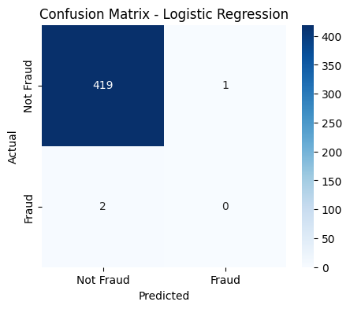
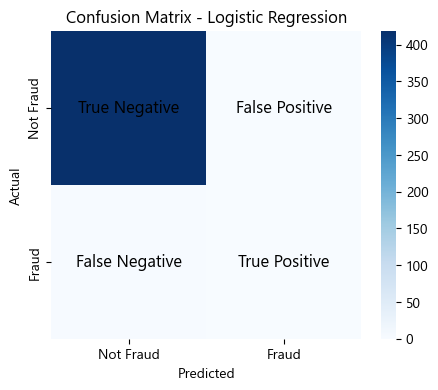

## Logistic Regression.
- Logistic Regression is a supervised machine learning algorithm used for binary classification problems, where the output is either 0 (Not Fraud) or 1 (Fraud).

### How does it work?

- It applies the logistic (sigmoid) function to predict the probability that a transaction is fraud.    
- If the probability ≥ 0.5, it's classified as fraud (1); otherwise, it's not fraud (0).    
- It finds the best-fit decision boundary to separate fraud and non-fraud transactions.   

### Why use Logistic Regression for fraud detection?
- Simple & interpretable   
- Works well with imbalanced datasets (with proper handling like SMOTE)   
- Outputs probabilities, allowing better fraud risk assessment   


```python
import pandas as pd

# Load the preprocessed data
df = pd.read_csv("processed_fraud_data.csv")

# Check if data is loaded correctly
df.info()
df.head()

```

    <class 'pandas.core.frame.DataFrame'>
    RangeIndex: 2106 entries, 0 to 2105
    Columns: 1713 entries, amt to state_WY
    dtypes: bool(1700), float64(7), int64(5), object(1)
    memory usage: 3.6+ MB
    


<div>
<style scoped>
    .dataframe tbody tr th:only-of-type {
        vertical-align: middle;
    }

    .dataframe tbody tr th {
        vertical-align: top;
    }

    .dataframe thead th {
        text-align: right;
    }
</style>
<table border="1" class="dataframe">
  <thead>
    <tr style="text-align: right;">
      <th></th>
      <th>amt</th>
      <th>lat</th>
      <th>long</th>
      <th>city_pop</th>
      <th>dob</th>
      <th>unix_time</th>
      <th>merch_lat</th>
      <th>merch_long</th>
      <th>is_fraud</th>
      <th>trans_hour</th>
      <th>...</th>
      <th>state_SD</th>
      <th>state_TN</th>
      <th>state_TX</th>
      <th>state_UT</th>
      <th>state_VA</th>
      <th>state_VT</th>
      <th>state_WA</th>
      <th>state_WI</th>
      <th>state_WV</th>
      <th>state_WY</th>
    </tr>
  </thead>
  <tbody>
    <tr>
      <th>0</th>
      <td>-0.425519</td>
      <td>-0.869318</td>
      <td>0.681600</td>
      <td>0.694702</td>
      <td>1968-03-19</td>
      <td>1371816865</td>
      <td>-0.857440</td>
      <td>0.660400</td>
      <td>0.0</td>
      <td>12</td>
      <td>...</td>
      <td>False</td>
      <td>False</td>
      <td>False</td>
      <td>False</td>
      <td>False</td>
      <td>False</td>
      <td>False</td>
      <td>False</td>
      <td>False</td>
      <td>False</td>
    </tr>
    <tr>
      <th>1</th>
      <td>-0.246984</td>
      <td>0.395931</td>
      <td>-1.556581</td>
      <td>-0.299792</td>
      <td>1990-01-17</td>
      <td>1371816873</td>
      <td>0.224245</td>
      <td>-1.518439</td>
      <td>0.0</td>
      <td>12</td>
      <td>...</td>
      <td>False</td>
      <td>False</td>
      <td>False</td>
      <td>True</td>
      <td>False</td>
      <td>False</td>
      <td>False</td>
      <td>False</td>
      <td>False</td>
      <td>False</td>
    </tr>
    <tr>
      <th>2</th>
      <td>-0.171282</td>
      <td>0.466054</td>
      <td>1.242956</td>
      <td>-0.197733</td>
      <td>1970-10-21</td>
      <td>1371816893</td>
      <td>0.431178</td>
      <td>1.191069</td>
      <td>0.0</td>
      <td>12</td>
      <td>...</td>
      <td>False</td>
      <td>False</td>
      <td>False</td>
      <td>False</td>
      <td>False</td>
      <td>False</td>
      <td>False</td>
      <td>False</td>
      <td>False</td>
      <td>False</td>
    </tr>
    <tr>
      <th>3</th>
      <td>-0.047076</td>
      <td>-1.943709</td>
      <td>0.690431</td>
      <td>-0.137229</td>
      <td>1987-07-25</td>
      <td>1371816915</td>
      <td>-1.881695</td>
      <td>0.684465</td>
      <td>0.0</td>
      <td>12</td>
      <td>...</td>
      <td>False</td>
      <td>False</td>
      <td>False</td>
      <td>False</td>
      <td>False</td>
      <td>False</td>
      <td>False</td>
      <td>False</td>
      <td>False</td>
      <td>False</td>
    </tr>
    <tr>
      <th>4</th>
      <td>-0.423335</td>
      <td>1.178837</td>
      <td>0.371939</td>
      <td>-0.297333</td>
      <td>1955-07-06</td>
      <td>1371816917</td>
      <td>1.314749</td>
      <td>0.305538</td>
      <td>0.0</td>
      <td>12</td>
      <td>...</td>
      <td>False</td>
      <td>False</td>
      <td>False</td>
      <td>False</td>
      <td>False</td>
      <td>False</td>
      <td>False</td>
      <td>False</td>
      <td>False</td>
      <td>False</td>
    </tr>
  </tbody>
</table>
<p>5 rows × 1713 columns</p>
</div>


```python

```


```python
# Check for missing values
print(df.isnull().sum().sum())  # Should print 0 if no missing values

# Check first few rows
print(df.head())

# Check target class distribution
print(df["is_fraud"].value_counts(normalize=True) * 100)  # Percentage of fraud vs. non-fraud

```

    0
            amt       lat      long  city_pop         dob   unix_time  merch_lat  \
    0 -0.425519 -0.869318  0.681600  0.694702  1968-03-19  1371816865  -0.857440   
    1 -0.246984  0.395931 -1.556581 -0.299792  1990-01-17  1371816873   0.224245   
    2 -0.171282  0.466054  1.242956 -0.197733  1970-10-21  1371816893   0.431178   
    3 -0.047076 -1.943709  0.690431 -0.137229  1987-07-25  1371816915  -1.881695   
    4 -0.423335  1.178837  0.371939 -0.297333  1955-07-06  1371816917   1.314749   
    
       merch_long  is_fraud  trans_hour  ...  state_SD  state_TN  state_TX  \
    0    0.660400       0.0          12  ...     False     False     False   
    1   -1.518439       0.0          12  ...     False     False     False   
    2    1.191069       0.0          12  ...     False     False     False   
    3    0.684465       0.0          12  ...     False     False     False   
    4    0.305538       0.0          12  ...     False     False     False   
    
       state_UT  state_VA  state_VT  state_WA  state_WI  state_WV  state_WY  
    0     False     False     False     False     False     False     False  
    1      True     False     False     False     False     False     False  
    2     False     False     False     False     False     False     False  
    3     False     False     False     False     False     False     False  
    4     False     False     False     False     False     False     False  
    
    [5 rows x 1713 columns]
    is_fraud
    0.0    99.477683
    1.0     0.522317
    Name: proportion, dtype: float64
    


```python

```

# Step 1: Import Libraries


```python
import numpy as np
import pandas as pd
import matplotlib.pyplot as plt
import seaborn as sns
from sklearn.model_selection import train_test_split
from sklearn.preprocessing import StandardScaler
from sklearn.linear_model import LogisticRegression
from sklearn.metrics import accuracy_score, classification_report, confusion_matrix

```


```python
## Imports necessary libraries for handling data, visualization, and model training.
```

## Step 2: Define Features (X) and Target (y)


```python
# Re-split the dataset to avoid errors
X = df.drop(columns=["is_fraud"])  # Ensure target variable is removed
y = df["is_fraud"]  # Target variable

# Split again (80% training, 20% testing)
from sklearn.model_selection import train_test_split
X_train, X_test, y_train, y_test = train_test_split(X, y, test_size=0.2, random_state=42, stratify=y)

```

## Step 3: Standardize the Data


```python
from sklearn.preprocessing import StandardScaler

# Select only numeric columns from X_train
numeric_cols = X_train.select_dtypes(include=["int64", "float64"]).columns

# Standardize only numeric features
scaler = StandardScaler()
X_train[numeric_cols] = scaler.fit_transform(X_train[numeric_cols].values)
X_test[numeric_cols] = scaler.transform(X_test[numeric_cols].values)

```


```python
print(X_train.info())  # Should only show numeric columns
print(y_train.value_counts())  # Should show class distribution

```

    <class 'pandas.core.frame.DataFrame'>
    Index: 1684 entries, 801 to 774
    Columns: 1712 entries, amt to state_WY
    dtypes: bool(1700), float64(11), object(1)
    memory usage: 2.9+ MB
    None
    is_fraud
    0.0    1675
    1.0       9
    Name: count, dtype: int64
    


```python

```

## Step 4: Train Logistic Regression Model


```python
print(X_train.dtypes[X_train.dtypes == "object"])  # Shows any remaining object-type columns

```

    dob    object
    dtype: object
    


```python
if "dob" in X_train.columns:
    X_train = X_train.drop(columns=["dob"])
    X_test = X_test.drop(columns=["dob"])

```


```python
print(X_train.dtypes.unique())  # Should only show float64, int64, or bool

```

    [dtype('float64') dtype('bool')]
    


```python
from sklearn.linear_model import LogisticRegression

log_model = LogisticRegression()  # Initialize model
log_model.fit(X_train, y_train)   # Train model on training data

```


<style>#sk-container-id-2 {
  /* Definition of color scheme common for light and dark mode */
  --sklearn-color-text: #000;
  --sklearn-color-text-muted: #666;
  --sklearn-color-line: gray;
  /* Definition of color scheme for unfitted estimators */
  --sklearn-color-unfitted-level-0: #fff5e6;
  --sklearn-color-unfitted-level-1: #f6e4d2;
  --sklearn-color-unfitted-level-2: #ffe0b3;
  --sklearn-color-unfitted-level-3: chocolate;
  /* Definition of color scheme for fitted estimators */
  --sklearn-color-fitted-level-0: #f0f8ff;
  --sklearn-color-fitted-level-1: #d4ebff;
  --sklearn-color-fitted-level-2: #b3dbfd;
  --sklearn-color-fitted-level-3: cornflowerblue;

  /* Specific color for light theme */
  --sklearn-color-text-on-default-background: var(--sg-text-color, var(--theme-code-foreground, var(--jp-content-font-color1, black)));
  --sklearn-color-background: var(--sg-background-color, var(--theme-background, var(--jp-layout-color0, white)));
  --sklearn-color-border-box: var(--sg-text-color, var(--theme-code-foreground, var(--jp-content-font-color1, black)));
  --sklearn-color-icon: #696969;

  @media (prefers-color-scheme: dark) {
    /* Redefinition of color scheme for dark theme */
    --sklearn-color-text-on-default-background: var(--sg-text-color, var(--theme-code-foreground, var(--jp-content-font-color1, white)));
    --sklearn-color-background: var(--sg-background-color, var(--theme-background, var(--jp-layout-color0, #111)));
    --sklearn-color-border-box: var(--sg-text-color, var(--theme-code-foreground, var(--jp-content-font-color1, white)));
    --sklearn-color-icon: #878787;
  }
}

#sk-container-id-2 {
  color: var(--sklearn-color-text);
}

#sk-container-id-2 pre {
  padding: 0;
}

#sk-container-id-2 input.sk-hidden--visually {
  border: 0;
  clip: rect(1px 1px 1px 1px);
  clip: rect(1px, 1px, 1px, 1px);
  height: 1px;
  margin: -1px;
  overflow: hidden;
  padding: 0;
  position: absolute;
  width: 1px;
}

#sk-container-id-2 div.sk-dashed-wrapped {
  border: 1px dashed var(--sklearn-color-line);
  margin: 0 0.4em 0.5em 0.4em;
  box-sizing: border-box;
  padding-bottom: 0.4em;
  background-color: var(--sklearn-color-background);
}

#sk-container-id-2 div.sk-container {
  /* jupyter's `normalize.less` sets `[hidden] { display: none; }`
     but bootstrap.min.css set `[hidden] { display: none !important; }`
     so we also need the `!important` here to be able to override the
     default hidden behavior on the sphinx rendered scikit-learn.org.
     See: https://github.com/scikit-learn/scikit-learn/issues/21755 */
  display: inline-block !important;
  position: relative;
}

#sk-container-id-2 div.sk-text-repr-fallback {
  display: none;
}

div.sk-parallel-item,
div.sk-serial,
div.sk-item {
  /* draw centered vertical line to link estimators */
  background-image: linear-gradient(var(--sklearn-color-text-on-default-background), var(--sklearn-color-text-on-default-background));
  background-size: 2px 100%;
  background-repeat: no-repeat;
  background-position: center center;
}

/* Parallel-specific style estimator block */

#sk-container-id-2 div.sk-parallel-item::after {
  content: "";
  width: 100%;
  border-bottom: 2px solid var(--sklearn-color-text-on-default-background);
  flex-grow: 1;
}

#sk-container-id-2 div.sk-parallel {
  display: flex;
  align-items: stretch;
  justify-content: center;
  background-color: var(--sklearn-color-background);
  position: relative;
}

#sk-container-id-2 div.sk-parallel-item {
  display: flex;
  flex-direction: column;
}

#sk-container-id-2 div.sk-parallel-item:first-child::after {
  align-self: flex-end;
  width: 50%;
}

#sk-container-id-2 div.sk-parallel-item:last-child::after {
  align-self: flex-start;
  width: 50%;
}

#sk-container-id-2 div.sk-parallel-item:only-child::after {
  width: 0;
}

/* Serial-specific style estimator block */

#sk-container-id-2 div.sk-serial {
  display: flex;
  flex-direction: column;
  align-items: center;
  background-color: var(--sklearn-color-background);
  padding-right: 1em;
  padding-left: 1em;
}


/* Toggleable style: style used for estimator/Pipeline/ColumnTransformer box that is
clickable and can be expanded/collapsed.
- Pipeline and ColumnTransformer use this feature and define the default style
- Estimators will overwrite some part of the style using the `sk-estimator` class
*/

/* Pipeline and ColumnTransformer style (default) */

#sk-container-id-2 div.sk-toggleable {
  /* Default theme specific background. It is overwritten whether we have a
  specific estimator or a Pipeline/ColumnTransformer */
  background-color: var(--sklearn-color-background);
}

/* Toggleable label */
#sk-container-id-2 label.sk-toggleable__label {
  cursor: pointer;
  display: flex;
  width: 100%;
  margin-bottom: 0;
  padding: 0.5em;
  box-sizing: border-box;
  text-align: center;
  align-items: start;
  justify-content: space-between;
  gap: 0.5em;
}

#sk-container-id-2 label.sk-toggleable__label .caption {
  font-size: 0.6rem;
  font-weight: lighter;
  color: var(--sklearn-color-text-muted);
}

#sk-container-id-2 label.sk-toggleable__label-arrow:before {
  /* Arrow on the left of the label */
  content: "▸";
  float: left;
  margin-right: 0.25em;
  color: var(--sklearn-color-icon);
}

#sk-container-id-2 label.sk-toggleable__label-arrow:hover:before {
  color: var(--sklearn-color-text);
}

/* Toggleable content - dropdown */

#sk-container-id-2 div.sk-toggleable__content {
  max-height: 0;
  max-width: 0;
  overflow: hidden;
  text-align: left;
  /* unfitted */
  background-color: var(--sklearn-color-unfitted-level-0);
}

#sk-container-id-2 div.sk-toggleable__content.fitted {
  /* fitted */
  background-color: var(--sklearn-color-fitted-level-0);
}

#sk-container-id-2 div.sk-toggleable__content pre {
  margin: 0.2em;
  border-radius: 0.25em;
  color: var(--sklearn-color-text);
  /* unfitted */
  background-color: var(--sklearn-color-unfitted-level-0);
}

#sk-container-id-2 div.sk-toggleable__content.fitted pre {
  /* unfitted */
  background-color: var(--sklearn-color-fitted-level-0);
}

#sk-container-id-2 input.sk-toggleable__control:checked~div.sk-toggleable__content {
  /* Expand drop-down */
  max-height: 200px;
  max-width: 100%;
  overflow: auto;
}

#sk-container-id-2 input.sk-toggleable__control:checked~label.sk-toggleable__label-arrow:before {
  content: "▾";
}

/* Pipeline/ColumnTransformer-specific style */

#sk-container-id-2 div.sk-label input.sk-toggleable__control:checked~label.sk-toggleable__label {
  color: var(--sklearn-color-text);
  background-color: var(--sklearn-color-unfitted-level-2);
}

#sk-container-id-2 div.sk-label.fitted input.sk-toggleable__control:checked~label.sk-toggleable__label {
  background-color: var(--sklearn-color-fitted-level-2);
}

/* Estimator-specific style */

/* Colorize estimator box */
#sk-container-id-2 div.sk-estimator input.sk-toggleable__control:checked~label.sk-toggleable__label {
  /* unfitted */
  background-color: var(--sklearn-color-unfitted-level-2);
}

#sk-container-id-2 div.sk-estimator.fitted input.sk-toggleable__control:checked~label.sk-toggleable__label {
  /* fitted */
  background-color: var(--sklearn-color-fitted-level-2);
}

#sk-container-id-2 div.sk-label label.sk-toggleable__label,
#sk-container-id-2 div.sk-label label {
  /* The background is the default theme color */
  color: var(--sklearn-color-text-on-default-background);
}

/* On hover, darken the color of the background */
#sk-container-id-2 div.sk-label:hover label.sk-toggleable__label {
  color: var(--sklearn-color-text);
  background-color: var(--sklearn-color-unfitted-level-2);
}

/* Label box, darken color on hover, fitted */
#sk-container-id-2 div.sk-label.fitted:hover label.sk-toggleable__label.fitted {
  color: var(--sklearn-color-text);
  background-color: var(--sklearn-color-fitted-level-2);
}

/* Estimator label */

#sk-container-id-2 div.sk-label label {
  font-family: monospace;
  font-weight: bold;
  display: inline-block;
  line-height: 1.2em;
}

#sk-container-id-2 div.sk-label-container {
  text-align: center;
}

/* Estimator-specific */
#sk-container-id-2 div.sk-estimator {
  font-family: monospace;
  border: 1px dotted var(--sklearn-color-border-box);
  border-radius: 0.25em;
  box-sizing: border-box;
  margin-bottom: 0.5em;
  /* unfitted */
  background-color: var(--sklearn-color-unfitted-level-0);
}

#sk-container-id-2 div.sk-estimator.fitted {
  /* fitted */
  background-color: var(--sklearn-color-fitted-level-0);
}

/* on hover */
#sk-container-id-2 div.sk-estimator:hover {
  /* unfitted */
  background-color: var(--sklearn-color-unfitted-level-2);
}

#sk-container-id-2 div.sk-estimator.fitted:hover {
  /* fitted */
  background-color: var(--sklearn-color-fitted-level-2);
}

/* Specification for estimator info (e.g. "i" and "?") */

/* Common style for "i" and "?" */

.sk-estimator-doc-link,
a:link.sk-estimator-doc-link,
a:visited.sk-estimator-doc-link {
  float: right;
  font-size: smaller;
  line-height: 1em;
  font-family: monospace;
  background-color: var(--sklearn-color-background);
  border-radius: 1em;
  height: 1em;
  width: 1em;
  text-decoration: none !important;
  margin-left: 0.5em;
  text-align: center;
  /* unfitted */
  border: var(--sklearn-color-unfitted-level-1) 1pt solid;
  color: var(--sklearn-color-unfitted-level-1);
}

.sk-estimator-doc-link.fitted,
a:link.sk-estimator-doc-link.fitted,
a:visited.sk-estimator-doc-link.fitted {
  /* fitted */
  border: var(--sklearn-color-fitted-level-1) 1pt solid;
  color: var(--sklearn-color-fitted-level-1);
}

/* On hover */
div.sk-estimator:hover .sk-estimator-doc-link:hover,
.sk-estimator-doc-link:hover,
div.sk-label-container:hover .sk-estimator-doc-link:hover,
.sk-estimator-doc-link:hover {
  /* unfitted */
  background-color: var(--sklearn-color-unfitted-level-3);
  color: var(--sklearn-color-background);
  text-decoration: none;
}

div.sk-estimator.fitted:hover .sk-estimator-doc-link.fitted:hover,
.sk-estimator-doc-link.fitted:hover,
div.sk-label-container:hover .sk-estimator-doc-link.fitted:hover,
.sk-estimator-doc-link.fitted:hover {
  /* fitted */
  background-color: var(--sklearn-color-fitted-level-3);
  color: var(--sklearn-color-background);
  text-decoration: none;
}

/* Span, style for the box shown on hovering the info icon */
.sk-estimator-doc-link span {
  display: none;
  z-index: 9999;
  position: relative;
  font-weight: normal;
  right: .2ex;
  padding: .5ex;
  margin: .5ex;
  width: min-content;
  min-width: 20ex;
  max-width: 50ex;
  color: var(--sklearn-color-text);
  box-shadow: 2pt 2pt 4pt #999;
  /* unfitted */
  background: var(--sklearn-color-unfitted-level-0);
  border: .5pt solid var(--sklearn-color-unfitted-level-3);
}

.sk-estimator-doc-link.fitted span {
  /* fitted */
  background: var(--sklearn-color-fitted-level-0);
  border: var(--sklearn-color-fitted-level-3);
}

.sk-estimator-doc-link:hover span {
  display: block;
}

/* "?"-specific style due to the `<a>` HTML tag */

#sk-container-id-2 a.estimator_doc_link {
  float: right;
  font-size: 1rem;
  line-height: 1em;
  font-family: monospace;
  background-color: var(--sklearn-color-background);
  border-radius: 1rem;
  height: 1rem;
  width: 1rem;
  text-decoration: none;
  /* unfitted */
  color: var(--sklearn-color-unfitted-level-1);
  border: var(--sklearn-color-unfitted-level-1) 1pt solid;
}

#sk-container-id-2 a.estimator_doc_link.fitted {
  /* fitted */
  border: var(--sklearn-color-fitted-level-1) 1pt solid;
  color: var(--sklearn-color-fitted-level-1);
}

/* On hover */
#sk-container-id-2 a.estimator_doc_link:hover {
  /* unfitted */
  background-color: var(--sklearn-color-unfitted-level-3);
  color: var(--sklearn-color-background);
  text-decoration: none;
}

#sk-container-id-2 a.estimator_doc_link.fitted:hover {
  /* fitted */
  background-color: var(--sklearn-color-fitted-level-3);
}
</style><div id="sk-container-id-2" class="sk-top-container"><div class="sk-text-repr-fallback"><pre>LogisticRegression()</pre><b>In a Jupyter environment, please rerun this cell to show the HTML representation or trust the notebook. <br />On GitHub, the HTML representation is unable to render, please try loading this page with nbviewer.org.</b></div><div class="sk-container" hidden><div class="sk-item"><div class="sk-estimator fitted sk-toggleable"><input class="sk-toggleable__control sk-hidden--visually" id="sk-estimator-id-2" type="checkbox" checked><label for="sk-estimator-id-2" class="sk-toggleable__label fitted sk-toggleable__label-arrow"><div><div>LogisticRegression</div></div><div><a class="sk-estimator-doc-link fitted" rel="noreferrer" target="_blank" href="https://scikit-learn.org/1.6/modules/generated/sklearn.linear_model.LogisticRegression.html">?<span>Documentation for LogisticRegression</span></a><span class="sk-estimator-doc-link fitted">i<span>Fitted</span></span></div></label><div class="sk-toggleable__content fitted"><pre>LogisticRegression()</pre></div> </div></div></div></div>


## Step 6: Make Predictions


```python
y_pred = log_model.predict(X_test)

# Uses the trained model to predict fraud vs. non-fraud for test data.


```

## Step 7: Evaluate Model Performance


```python
accuracy = accuracy_score(y_test, y_pred)
conf_matrix = confusion_matrix(y_test, y_pred)
class_report = classification_report(y_test, y_pred)

```

#### accuracy_score(y_test, y_pred) → Measures overall model accuracy.
#### confusion_matrix(y_test, y_pred) → Shows TP, FP, TN, FN values.
#### classification_report(y_test, y_pred) → Provides precision, recall, and F1-score.

## Step 8: Print Results


```python
print(f"Model Accuracy: {accuracy:.2f}")
print("\nConfusion Matrix:\n", conf_matrix)
print("\nClassification Report:\n", class_report)

```

    Model Accuracy: 0.99
    
    Confusion Matrix:
     [[419   1]
     [  2   0]]
    
    Classification Report:
                   precision    recall  f1-score   support
    
             0.0       1.00      1.00      1.00       420
             1.0       0.00      0.00      0.00         2
    
        accuracy                           0.99       422
       macro avg       0.50      0.50      0.50       422
    weighted avg       0.99      0.99      0.99       422
    
    


```python
# prints accuracy and evaluation metrics to understand model performance.
```


```python

```

## Step 9: Visualize Confusion Matrix


```python
plt.figure(figsize=(5, 4))
sns.heatmap(conf_matrix, annot=True, fmt="d", cmap="Blues", xticklabels=["Not Fraud", "Fraud"], yticklabels=["Not Fraud", "Fraud"])
plt.xlabel("Predicted")
plt.ylabel("Actual")
plt.title("Confusion Matrix - Logistic Regression")
plt.show()

```


    

    


```python
import matplotlib.pyplot as plt
import seaborn as sns
import numpy as np

# Confusion matrix values
conf_matrix = np.array([[419, 1], [2, 0]])

# Define true/false labels
labels = np.array([["True Negative", "False Positive"], 
                   ["False Negative", "True Positive"]])

# Plot heatmap
plt.figure(figsize=(5, 4))
ax = sns.heatmap(conf_matrix, annot=False, fmt="", cmap="Blues", xticklabels=["Not Fraud", "Fraud"], yticklabels=["Not Fraud", "Fraud"])

# Overlay labels
for i in range(2):
    for j in range(2):
        plt.text(j + 0.5, i + 0.5, labels[i][j], ha="center", va="center", fontsize=12, color="black")

plt.xlabel("Predicted")
plt.ylabel("Actual")
plt.title("Confusion Matrix - Logistic Regression")
plt.show()

```


    

    


```python

```

# Conclusion for Logistic Regression in Fraud Detection
## From the confusion matrix results, we can draw the following conclusions about the performance of the Logistic Regression model in detecting fraud:

### 1️⃣ High True Negatives (TN = 419)

- The model correctly identified 419 non-fraudulent transactions.
- This indicates strong performance in detecting legitimate transactions.

### 2️⃣ Low False Positives (FP = 1)

- Only 1 legitimate transaction was misclassified as fraud.
- This means the model is highly precise in not wrongly flagging normal transactions.

### 3️⃣ False Negatives (FN = 2) – Missed Fraud Cases

- 2 fraudulent transactions were misclassified as non-fraudulent.
- This is a critical issue because missing fraud is more dangerous than a false alarm.

### 4️⃣ True Positives (TP = 0) – No Fraud Caught

- The model failed to detect any fraudulent transactions (TP = 0).
- This suggests that the model struggles with fraud detection, likely due to class imbalance in the dataset.


```python

```
